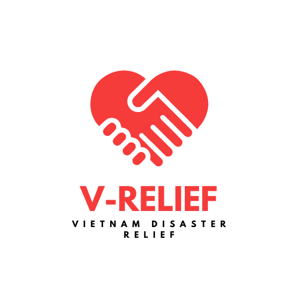
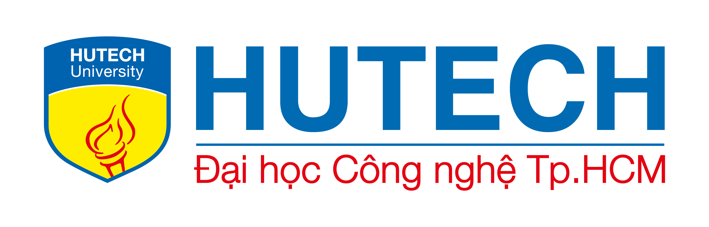

<p align="center">
	
</p>

<h1 align="center">V-RELIEF</h1>
<P align=center>VIETNAM DISASTER RELIEF SYSTEM</P>
<p align="center">
  <a href="https://foxminchan.github.io/LawKnowledge/" rel="dofollow" target="blank"><strong>Explore the docs »</strong></a>
	<br/>
	<br/>
	<a href="https://github.com/huynguyenjv/V-RELIEF/issues/new?assignees=&labels=&projects=&template=bug_report.md&title=">🐛 Report Bug</a>
	|
	<a href="https://github.com/huynguyenjv/V-RELIEF/issues/new?assignees=&labels=&projects=&template=feature_request.md&title=">✈️ Request Feature</a>
	|
	<a href="https://t.me/+bz74heXQgBwwOWRl">💬 Join Our Telegram</a>
	|
	<a href="https://github.com/foxminchan/LawKnowledge/wiki">📚 Read Wiki</a>
	|
	<a href="https://github.com/users/foxminchan/projects/8">📋 Roadmap</a>
</p>

<p align="center">
	<a href="https://github.com/huynguyenjv/V-RELIEF/issues" target="blank">
		
	</a>
	<a href="https://github.com/huynguyenjv/V-RELIEF/blob/main/LICENSE" target="blank">
		
	</a>
	<a href="https://colab.research.google.com/drive/1HcL3VrdKhQ1f4ZxbYOhiw_kYTtxRlT_f?usp=sharing" target="_blank">
		
	</a>
	<a href="https://gitpod.io/new/#https://github.com/foxminchan/LawKnowledge" target="_blank">
		
	</a>
	<a href="https://t.me/+bz74heXQgBwwOWRl" target="_blank">
		
	</a>
</p>


<br/>


<p align="center">
	<a href="https://sonarcloud.io/summary/new_code?id=foxminchan_LawKnowledge" target="blank">
		
	</a>
	<a href="https://app.pulumi.com/new?template=https://github.com/foxminchan/LawKnowledge/tree/main/deploys/iac/pulumi" target="blank">
		
	</a>
</p>

<h1>Features</h1>

- 📖 Document Organization and Linking
- 📦 Terminology Extraction
- 🔍 Quick Search for Related Content
- 🤖 User Query Support

<h1>Table of Contents</h1>

<details>
<summary>Expand contents</summary>

- [What is V-RELIEF?](#what-is-v-relief)
- [Tentative technologies](#tentative-technologies)
- [Building blocks](#building-blocks)
- [Getting Started](#getting-started)
	- [🛠️ Prerequisites](#️-prerequisites)
		- [Infrastucture](#infrastucture)
		- [Services](#services)
	- [🧑‍💻 Setup](#-setup)
	- [🚀 Running](#-running)
	- [🧪 Testing](#-testing)
	- [🧩 Other](#-other)
- [Dependency Graph](#dependency-graph)
- [CI/CD](#cicd)
- [Contributing](#contributing)
	- [📖 Contributing Guidelines](#-contributing-guidelines)
	- [💁 Want to Help?](#-want-to-help)
	- [🫂 Code of Conduct](#-code-of-conduct)
- [Support and Organization](#support-and-organization)
- [License](#license)

</details>

# What is V-RELIEF?

<p align="justify">
V-Relief is an innovative emergency response and disaster recovery platform designed to support communities in Vietnam during and after natural disasters such as storms and floods. The platform integrates real-time disaster tracking, utilizing tools like Windy Maps for monitoring and visualizing storm paths, and Goong Maps for pinpointing user locations and nearby relief centers. V-Relief streamlines essential supply distribution, allowing affected individuals to register their needs, while volunteers can offer services like transportation and first aid through an interactive community support map. With n8n automating workflows and notifications, the system efficiently connects those in need with resources and assistance. Additional features, such as damage area lookup, self-rescue knowledge databases, and social media integration, ensure comprehensive support, fostering resilience and coordinated relief efforts across Vietnam.
</p>

[](https://stars.medv.io/foxminchan/LawKnowledge)

<blockquote>
	<p align="justify">
		<b>V-Relief</b> is a comprehensive disaster response and recovery application designed for Vietnam, providing critical support during and after natural disasters such as storms and floods. Built on a <b> Microservice Architecture </b>, V-Relief leverages <b>Generative AI </b> to analyze disaster-related data and optimize resource allocation. It features an intelligent <b> Question Answering</b> system  to address user inquiries about relief efforts, emergency procedures, and self-rescue knowledge. Developed using <b>Open Source</b> technologies, the platform ensures transparency and flexibility. Deployed on <b>Cloud</b> infrastructure, V-Relief delivers real-time data processing, seamless scalability, and reliable access for both victims and volunteers, enhancing coordination and resilience across affected communities.
	</p>
</blockquote>

If you want to find out more about the contest, please visit the [VFOSSA website](https://vfossa.vn/tin-tuc/de-thi-phan-mem-nguon-mo-olp-2023-688.html).


# Tentative technologies

- [React](https://reactjs.org/)
- [Python](https://www.python.org/)
- [Kafka](https://kafka.apache.org/)
- [ArgoCD](https://argoproj.github.io/argo-cd/)
- [Jenkins](https://www.jenkins.io/)
- [OpenTelemetry](https://opentelemetry.io/)
- [Grafana](https://grafana.com/), [Prometheus](https://prometheus.io/), [Zipkin](https://zipkin.io/), [Fluentd](https://www.fluentd.org/)

# Building blocks

<p align="justify">
We used <b>Microservice Architecture</b> to build this project to make it easier to scale and maintain. The following diagram shows the architecture of the project.
</p>


# Getting Started

## 🛠️ Prerequisites

### Infrastucture

<ul>
	<li align="justify">
		<b><a href="https://nodejs.org/en/" target="_blank">Nodejs</a></b> - Node.js® is a JavaScript runtime built on Chrome's V8 JavaScript engine.
	</li>
	<li align="justify">
		<b><a href="https://www.npmjs.com/" target="_blank">npm</a></b> - Fast, disk space efficient package manager.
	</li>
	<li align="justify">
		<b><a href="https://www.python.org/" target="_blank">Python</a></b> - Python is a programming language that lets you work quickly and integrate systems more effectively.
	</li>
	<li align="justify">
		<b><a href="https://python-poetry.org/" target="_blank">N8N</a></b> - Poetry helps you declare, manage and install dependencies of Python projects, ensuring you have the right stack everywhere.
	</li>
	<li align="justify">
		<b><a href="https://www.pulumi.com/" target="_blank">Pulumi</a></b> - Pulumi is a manage infrastructure, secrets, and configurations intuitively on any cloud.
	</li>
	<li align="justify">
		<b><a href="https://www.docker.com/" target="_blank">Docker (Kubernetes Enabled)</a></b> - Docker is an open platform for developing, shipping, and running applications.
	</li>
	<li align="justify">
		<b><a href="https://helm.sh/" target="_blank">Helm</a></b> - Helm is the best way to find, share, and use software built for Kubernetes.
	</li>
</ul>


## 🧑‍💻 Setup

First, clone the repository to your local machine:

```bash
git clone https://github.com/huynguyenjv/V-RELIEF
```

Next, navigate to the root directory of the project and install the dependencies:

```bash
npm install --force
```

## 🚀 Running

For the website, you can run the following command:

```bash
npm run dev
```

> [!IMPORTANT]
>
> <p align="justify">
> If you want to run with Nx, make sure you have installed `poetry` globally. Python version must be `>=3.9.1 <=3.12`.
> </p>


# Contributing

## 📖 Contributing Guidelines

<p align="justify">

We are excited that you are interested in contributing to this project! Before submitting your contribution, please make sure to take a moment and read through the following guidelines:

Read through our [contributing guidelines](.github/CONTRIBUTING.md) to learn about our submission process, coding rules, and more.

</p>

## 💁 Want to Help?

<p align="justify">

Want to report a bug, contribute some code, or improve the documentation? Excellent! Read up on our guidelines for [contributing](.github/CONTRIBUTING.md) and then check out one of our issues labeled as <kbd>[help wanted](https://github.com/huynguyenjv/V-RELIEF/labels/help%20wanted)</kbd> or <kbd>[good first issue](https://github.com/huynguyenjv/V-RELIEF/labels/good%20first%20issue)</kbd>.

</p>

## 🫂 Code of Conduct

<p align="justify">

Help us keep Law Knowledge open and inclusive. Please read and follow our [Code of Conduct](.github/CODE_OF_CONDUCT.md).

</p>

# Support and Organization

<p align="center">
	<a href="https://hutech.edu.vn/" target="_blank">
		
	</a>
	<a href="https://vfossa.vn/" target="_blank">
		
	</a>
	<a href="http://husc.hueuni.edu.vn/" target="_blank">
		
	</a>
	<a href="https://olp.husc.edu.vn/" target="_blank">
		
	</a>
</p>

# License

<p align="justify">

This project is licensed under the terms of the [GNU](LICENSE) license.

</p>

